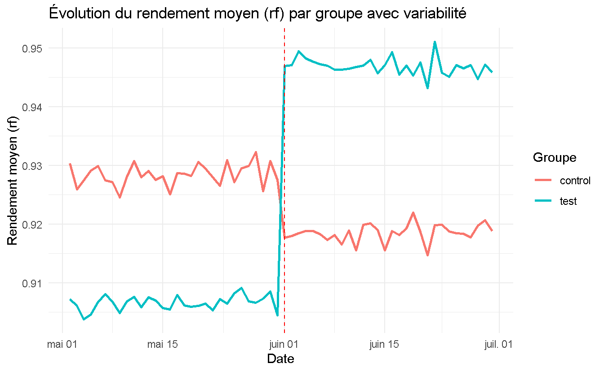

# pot_test_modelling_simul_2025

Test de d'évaluation de test sur des cuves d'électrolyse sur la base de données simulées
générées par Copilot.

## Données Type



## Modèle

La formule du **modèle linéaire mixte** à utiliser est :

``` r
model_lmer_avec_inter <- lme4::lmer(rf ~ period*group + (1 | tank) + (1| date), data = data_model)
```

Le terme d'interaction entre `period` et `group` donne l'effet de l'intervention sur le
groupe traité par rapport au groupe témoin. Le terme `(1 | tank)` indique que les cuves
sont considérées comme des effets aléatoires, permettant de capturer la variabilité entre
les cuves. Le terme `(1 | date)` permet de prendre en compte la variabilité temporelle.

## Points Importants

1.  **Ordonner les facteurs** dans le bon ordre pour les modèles linéaires : ref/essai et
    avant/après intervention.
2.  Utiliser des modèles linéaires avec des effets de période et de groupe **avec
    interaction**; l'**interaction période:groupe** permet de capturer l'effet du test sur
    les cuves après la date d'intervention. Les modèles sans interaction ne donnent pas le
    résultat correct. L'interprétation est que l'interaction groupe:période (cuves
    test:période test) permet d'isoler l'effet du test sur les cuves de test
    indépendamment des facteurs groupe hors période test et période hors groupe test.

## Visualisation des résultats

### Table

```{R}
sjPlot::tab_model(model_lmer_avec_inter, 
                show.ci = FALSE, 
                digits = 3,
                show.se = TRUE, 
                show.stat = TRUE, 
                show.p = TRUE,
                pred.labels = c("(Intercept)", "Période après intervention", "Groupe test", "Interaction période: groupe test"),
                dv.labels = "Modèle linéaire hierarchique avec interaction")
```

### Graphique

```{r}
sjPlot::plot_model(model_lmer_avec_inter, 
                type = "pred", 
                show.data = TRUE, 
                show.p = TRUE, 
                pred.labels = c("(Intercept)", "Période après intervention", "Groupe test", "Interaction période: groupe test"),
                dv.labels = "Modèle linéaire hierarchique avec interaction")

```

## Function d'extraction des résultats des modèles linéaires transformés ou non transformés

```{r, echo = true, eval = FALSE}
extract_ci_inter_model = function(
  model,
  pattern = ":", # motif pour sélection des termes
  z = 1.96, # valeur z pour l'intervalle de confiance à 95%
  log_resp = F, # si la réponse est log-transformée
  digits = 3 # nombre de décimales pour l'affichage
) {
  coef_full = summary(model)$coefficients |>
    as.data.frame() |>
    tibble::rownames_to_column("term")
  # vérification si des termes sont sélectionnés
  if (sum(stringr::str_detect(coef_full$term, pattern) == 0)) {
    stop(
      "Aucun terme correspondant au motif spécifié n'a été trouvé dans le modèle."
    )
  }

  if (!log_resp) {
    # model non exponentié
    # Ajout des colonnes ci_lower et ci_upper
    coef_sel = coef_full |>
      filter(stringr::str_detect(term, pattern)) |>
      mutate(
        ci_lower = Estimate - 1.96 * `Std. Error`,
        ci_upper = Estimate + 1.96 * `Std. Error`
      ) |>
      select(term, Estimate, ci_lower, ci_upper) |>
      mutate(
        # digits = 3
        Estimate = round(Estimate, digits),
        ci_lower = round(ci_lower, digits),
        ci_upper = round(ci_upper, digits)
      )
    return(coef_sel)
  } else {
    # intercept  : valeur de référence pour multiplier les coefficients
    intercept_log = coef_full |>
      filter(term == "(Intercept)") |>
      pull(Estimate)
    intercept = exp(intercept_log)
    # function de transformation des coefficients
    function_exp = function(x) {
      exp(x + intercept_log) - intercept
    }
    # Ajout des colonnes ci_lower et ci_upper
    coef_sel = coef_full |>
      filter(stringr::str_detect(term, pattern)) |>
      mutate(
        ci_lower = Estimate - z * `Std. Error`,
        ci_upper = Estimate + z * `Std. Error`
      ) |>
      select(term, Estimate, ci_lower, ci_upper)
    # Exponentiation des coefficients
    coef_sel = coef_sel |>
      mutate(
        Estimate = if_else(
          term == "(Intercept)",
          exp(Estimate), # exponentiation de l'intercept
          function_exp(Estimate) # exponentiation des autres coefficients
        ),
        ci_lower = if_else(
          term == "(Intercept)",
          exp(ci_lower), # exponentiation de l'intercept
          function_exp(ci_lower) # exponentiation des autres coefficients
        ),
        ci_upper = if_else(
          term == "(Intercept)",
          exp(ci_upper), # exponentiation de l'intercept
          function_exp(ci_upper) # exponentiation des autres coefficients
        )
      ) |>
      mutate(
        # digits = 3
        Estimate = round(Estimate, digits),
        ci_lower = round(ci_lower, digits),
        ci_upper = round(ci_upper, digits)
      )
    return(coef_sel)
  }
}
```
